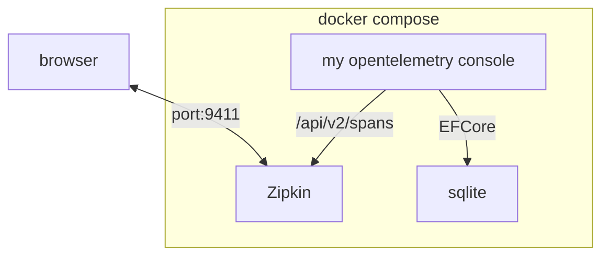
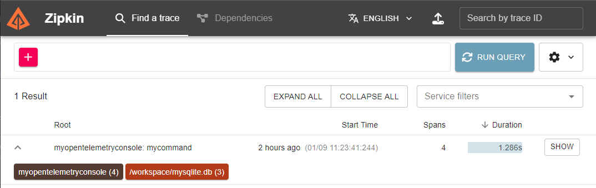
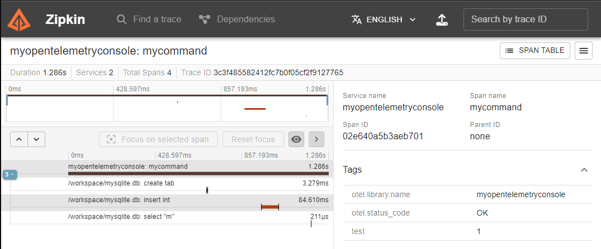

# My OpenTelemetry dotnet sample(Generic Host)

## Overview
I am sending Traces to Zipkin in a console application using a generic host.

I am also tracing database operations using [OpenTelemetry.Instrumentation.EntityFrameworkCore](https://www.nuget.org/packages/OpenTelemetry.Instrumentation.EntityFrameworkCore/#readme-body-tab).



## Usage
```sh
docker compose up -d
```

## Result

It takes some time for the traces to be displayed.

[http://localhost:9411/zipkin](http://localhost:9411/zipkin)





## Development environment

Let's work inside containers.

```sh
docker compose -f docker-compose.yml -f docker-compose.development.yml up -d
docker exec -it myopentelemetryconsole-development /bin/bash
```
